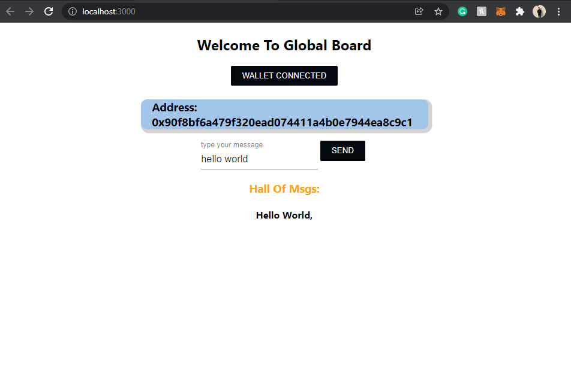

# Global_board
A Web3.js application powered by react.js and Soilidity (React-Dapp). 'Global Board' is an application where individuals can write their words which will remain listed  on the blockchain and displayed for eternity on the "Hall Of Msgs".

## Dependencies:
-ethers.js
-@material-ui

## Utilities:
- Blockchain: ganache-cli
- SmartContract: Solidity
- Frontend: React.js
- Deployment: Python

